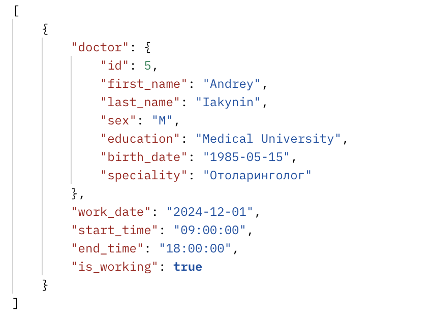

#  Реализация серверной части приложения средствами django и djangorestframework в соответствии с заданием из текста работы.

## Описание моего варианта

Задание 10
Создать программную систему, предназначенную для администратора лечебной
клиники.
Прием пациентов ведут несколько врачей различных специализаций. На каждого
пациента клиники заводится медицинская карта, в которой отражается вся
информация по личным данным больного и истории его заболеваний (диагнозы). При
очередном посещении врача в карте отражается дата и время приема, диагноз, текущее
состояние больного, рекомендации по лечению. Так как прием ведется только на
коммерческой основе, после очередного посещения пациент должен оплатить
медицинские услуги (каждый прием оплачивается отдельно). Расчет стоимости
посещения определяется врачом согласно прейскуранту по клинике.
Для ведения внутренней отчетности необходима следующая информация о врач:
фамилия, имя, отчество, специальность, образование, пол, дата рождения и дата начала
и окончания работы в клинике, данные по трудовому договору. Для каждого врача
составляется график работы с указанием рабочих и выходных дней.
Прием пациентов врачи могут вести в разных кабинетах. Каждый кабинет имеет
определенный режим работы, ответственного и внутренний телефон.
Перечень возможных запросов к базе данных:
1. Вывести по алфавиту список всех пациентов заданного врача с датами и
стоимостью приемов.
2. Вывести телефоны всех пациентах, которые посещали отоларингологов и
год рождения которых больше, чем 1987.
3. Вывести список врачей, в графике которых среди рабочих дней имеется
заданный.
4. Количество приемов пациентов по датам.
5. Вычислить суммарную стоимость лечения пациентов по дням и по врачам.
6. Список пациентов, уже оплативших лечение.
Перечень возможных отчетов:

1. Отчет о работе врачей в заданный промежуток времени с указанием списка
принятых пациентов, их диагноза и стоимости услуг с вычислением
суммарного дохода по каждому врачу.
## Стек реализации

- Язык: Python
- фреймворк : Django, DRF

## serializers
```python
class PatientSerializer(serializers.ModelSerializer):
    class Meta:
        model = Patient
        fields = ['id', 'first_name', 'last_name', 'birth_date']


class DoctorSerializer(serializers.ModelSerializer):
    class Meta:
        model = Doctor
        fields = '__all__'


class AppointmentSerializer(serializers.ModelSerializer):
    patient = PatientSerializer(read_only=True)
    doctor = DoctorSerializer(read_only=True)
    class Meta:
        model = Appointment
        fields = ['id', 'appointment_date', 'appointment_time', 'patient', 'doctor', 'cabinet', 'service']


class PaymentSerializer(serializers.ModelSerializer):
    patient = PatientSerializer(read_only=True)
    class Meta:
        model = Payment
        fields = ['patient', 'service', 'amount', 'payment_date', 'is_paid']


class MedicalCardSerializer(serializers.ModelSerializer):
    patient = PatientSerializer(read_only=True)
    class Meta:
        model = MedicalCard
        fields = ['patient', 'record_date', 'diagnosis']
```
Описание
PatientSerializer - Используется для работы с данными о пациентах, включая их чтение и сохранение.

DoctorSerializer - Этот сериализатор подходит для работы с полной информацией о врачах, включая их чтение и сохранение.

AppointmentSerializer - Используется для работы с записями на прием, включая данные о пациенте и враче.

PaymentSerializer - Используется для работы с данными об оплатах, включая информацию о пациенте и услугах.

MedicalCardSerializer - Предназначен для работы с медицинскими картами, включая информацию о диагнозах и пациентах.

## Примеры запросов
```python
http://127.0.0.1:8000/api/appointments/
выводит
[
  {
    "id": 1,
    "appointment_date": "2024-12-01",
    "appointment_time": "18:00:00",
    "patient": {
      "id": 1,
      "first_name": "Andrey",
      "last_name": "Iakynin",
      "birth_date": "2024-12-10"
    },
    "doctor": {
      "id": 1,
      "first_name": "Kirill",
      "last_name": "Kisikev",
      "sex": "M",
      "education": "Ped",
      "birth_date": "2024-12-10"
    },
    "cabinet": 1,
    "service": 1
  }
]

http://127.0.0.1:8000/api/cabinets/
выводит
[
  {
    "id": 1,
    "number": "101"
  }
]

http://127.0.0.1:8000/api/doctor_schedule/
выводит
[
  {
    "doctor": {
      "id": 1,
      "first_name": "Kirill",
      "last_name": "Kisikev",
      "sex": "M",
      "education": "Ped",
      "birth_date": "2024-12-10"
    },
    "work_date": "2024-12-11",
    "start_time": "14:36:18",
    "is_working": true
  }
]
```
## Djoser
```python
метод POST
создания пользователя 
http://127.0.0.1:8000/api/auth/users/

Метод POST
Получение токена
http://127.0.0.1:8000/api/auth/token/login

Метов GET
Получение пользователя по токену
http://127.0.0.1:8000/api/auth/users/me/

```

## Аналитические запросы
1. Вывести по алфавиту список всех пациентов заданного врача с датами и
стоимостью приемов.

Запрос  http://localhost:8000/api/doctors/3/appointments/


2. Вывести телефоны всех пациентах, которые посещали отоларингологов и
год рождения которых больше, чем 1987.

Запрос http://localhost:8000/api/otolaryngologist-patients/


3. Вывести список врачей, в графике которых среди рабочих дней имеется
заданный.

Запрос http://localhost:8000/api/doctors-with-workday/?date=2024-12-01



4. Количество приемов пациентов по датам.

Запрос http://localhost:8000/api/appointments-count-by-date/?date=2024-12-01


5. Вычислить суммарную стоимость лечения пациентов по дням и по врачам.

Запрос http://localhost:8000/api/total-treatment-cost-by-day-and-doctor/?date=2024-12-01


6. Список пациентов, уже оплативших лечение.

Запрос http://localhost:8000/api/paid-patients/


