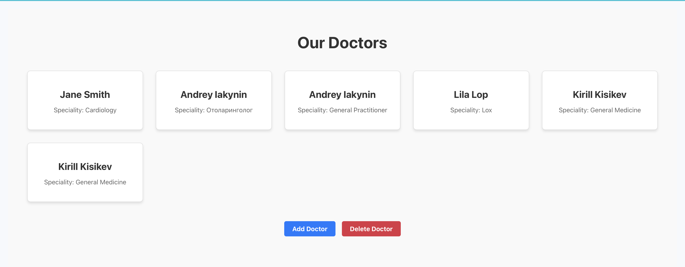

# Сайт для администрации мед клиники

## Главная странца


реализация этой страницы
```python
import React from "react";
import { Link } from "react-router-dom";
import "./Home.css";
import doctorsImage from "../../assets/images/doctors.jpeg";

const Home = () => {
    return (
        <div className="home">
            <div className="home-left">
                <h1>Welcome</h1>
                <h2>Medical Clinic that You Can Trust</h2>
                <p>Providing the best healthcare services for you and your family.</p>
                <div className="buttons">
                    <Link to="/services" className="btn btn-services">Services</Link>
                    <button className="btn-info">More Info</button>
                </div>
            </div>
            <div className="home-right">
                
            </div>
        </div>
    );
};

export default Home;
```


## Страница для получения докторов

```python
Код Api для получучения
import axiosInstance from './axiosInstance';

// Получение списка докторов
export const getDoctors = async () => {
    try {
        const response = await axiosInstance.get('/doctors/');
        return response.data;
    } catch (error) {
        console.error("Error fetching doctors:", error);
        throw error;
    }
};

// Добавление нового доктора
export const addDoctor = async (doctorData) => {
    try {
        const response = await axiosInstance.post('/doctors/', doctorData);
        return response.data; 
    } catch (error) {
        console.error("Error adding doctor:", error);
        throw error; 
    }
};

// Удаление доктора по id
export const deleteDoctor = async (doctorId) => {
    try {
        const response = await axiosInstance.delete(`/doctors/${doctorId}/`);
        return response.data; // Возвращаем данные ответа
    } catch (error) {
        console.error("Error deleting doctor:", error);
        throw error; 
    }
};
```
```python
## Назначение приема


Код APi
import axiosInstance from './axiosInstance';

export const getAppointments = async () => {
    const response = await axiosInstance.get('/appointments/');
    return response.data;
};

export const addAppointment = async (appointmentData) => {
    try {
        const response = await axiosInstance.post('/appointments/', appointmentData);
        return response.data;
    } catch (error) {
        console.error("Error adding appointment:", error);
        throw error;
    }
};

export const deleteAppointment = async (appointmentId) => {
    try {
        const response = await axiosInstance.delete(`/appointments/${appointmentId}/`);
        return response.data;
    } catch (error) {
        console.error("Error deleting appointment:", error);
        throw error;
    }
};


export const updateAppointment = async (appointmentId, updatedData) => {
    try {
        const response = await axiosInstance.put(`/appointments/${appointmentId}/`, updatedData);
        return response.data;
    } catch (error) {
        console.error("Error updating appointment:", error);
        throw error;
    }
};

```

## Код для получние Токена авторизаци
import axios from 'axios';


const getAuthToken = () => localStorage.getItem("authToken");


const axiosInstance = axios.create({
    baseURL: 'http://127.0.0.1:8000/api',
    headers: {
        'Authorization': `Token ${getAuthToken()}`,
    },
});


export default axiosInstance;
